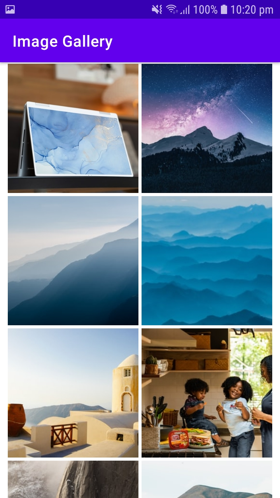

#Image Gallery

 

    

 

## Architecture
* Built with MVP

## Built With 🛠
- [Kotlin](https://kotlinlang.org/) - Official programming language for Android development.
- [Retrofit](https://square.github.io/retrofit/) - A type-safe HTTP client for Android and Java.
- [DataBinding](https://developer.android.com/topic/libraries/data-binding) - Support library that allows to bind UI components
- [UnSplash API](https://unsplash.com/developers) - The Unsplash API is a modern JSON API that surfaces all of the info developer need to build any experience for your users.